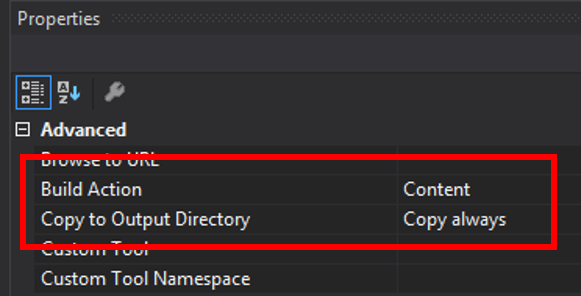

# Dynatrace OneAgent on Azure CloudServices

You can use Azure CloudService [Startup Tasks](https://docs.microsoft.com/en-us/azure/cloud-services/cloud-services-startup-tasks) to perform operations before a role starts. Using such a task you can run the OneAgent to get fullstack visibility into your Azure Cloud-Services. 

The following instructions provide scripts to download and run the Dynatrace OneAgent installer. The integration is the same for Web- and Workerroles.

## Prerequisites
To use the integration, you need the Dynatrace **Environment ID** and **API Token**.
For more details how to retrieve those values [see Dynatrace Help](https://www.dynatrace.com/support/help/shortlink/azure-vm#prerequisites) 

###  Additional configuration parameters
#### Dynatrace.ConnectionPoint
If you're using Dynatrace Managed or your communication should be routed through a specific ActiveGate, you need to configure your custom communication endpoint.

The URL pattern for the API endpoint is as follows: https://<YourDynatraceServerURL>/e/<YourEnvironmentID>/api

<YourDynatraceServerURL> and <YourEnvironMentID> need to be replaced.

## Setup

1. Add the InstallDynatraceInCloudService.ps1 and startup-dynatrace.cmd to your  CloudService project in Visual Studio. 

Make sure the newly added files are configured to be copied to the output directoy when the application is packagged.

2. Add the additional settings **Dynatrace.EnvironmentID** and **Dynatrace.APIToken** to your [ServiceDefination.csdef](#ServiceDefination.csdef) file. Optionally add [Dynatrace.ConnectionPoint](#Dynatrace.ConnectionPoint) if you are required to use an alternative communication endpoint. 

3. Add a startup task in your ServiceDefination.csdef to run startup-dynatrace.cmd at role startup. [See here](#ServiceDefinition.csdef)

3. Add the configuration values in your [ServiceConfiguration.*.cscfg](#ServiceConfiguration.Cloud.cscfg) file's. 

### What the script-files do
#### startup-dynatrace.cmd 
This is the script for your startup-task, which simply just calls powershell with the installer script.  

#### InstallDynatraceInCloudService.ps1 ##
This script is responsible for downloading and installing the Dynatrace OneAgent. 

Since the startup task is run every role start, the script checks the various CloudService lifecycle events to ensure it's only installed once at initial provisioning of the virtual machine.  

### Example configuration files
#### ServiceDefinition.csdef 
Example service definition file showing the addtional Dynatrace settings as well as the configuration for the startup task. 

#### ServiceConfiguration.Cloud.cscfg
Example configuration file showing the additional configuration related to the additional settings defined in the ServiceDefination.csdef file.

### Troubleshooting
For troubleshooting you can remotely access your role instance and view the installer log at c:\Dynatrace-Install.log. 

In case you no log is written, verify that your scripts are included in your application package and/or your path to your startup startup task is correct. 

